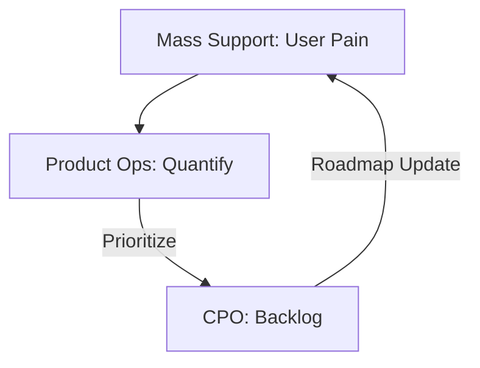

# 💬 Customer Feedback | Support + Product Ops + CPO

Workflow to close the loop between user frustration and strategic roadmap prioritization.

## 📋 Role & Coordination
- **Antenna**: `[[mass-support|Mass Support Agent]]` collects the raw qualitative pain points and feature requests.
- **Quantifier**: `[[product-ops|Product Ops Agent]]` categorizes the feedback and calculates the reach and severity of each issue.
- **Strategist**: `[[cpo-agent|CPO Agent]]` decides if an issue warrants a change in the current strategic roadmap.

## ⚙️ Execution Logic (SOP)

**Step 1: Feedback Collection (Support)**
1. The **Support Agent** identifies a recurring theme in user tickets (e.g., "Login is slow").
2. Uses `<thinking>` to extract the core emotional frustration and technical context.
3. Executes `summarize_support_themes`.

**Step 2: Quantification (Product Ops)**
1. **Product Ops** receives the themes and crosses them with user segment data.
2. Uses `<thinking>` to assign a **Severity Score** (Critical/Major/Minor) and a **Reach Score**.
3. Executes `prioritize_user_feedback`.

**Step 3: Roadmap Integration (CPO)**
1. The **CPO** reviews the high-severity feedback list.
2. Uses `<thinking>` to determine if fixing this aligns with current OKRs or if it needs to be deferred.
3. Executes `pivot_product_strategy` if the issue is a "show-stopper".

**Step 4: Closing the Loop**
1. Once the CPO decides, **Product Ops** notifies **Support**.
2. Support updates the public documentation or knowledge base to manage user expectations.
