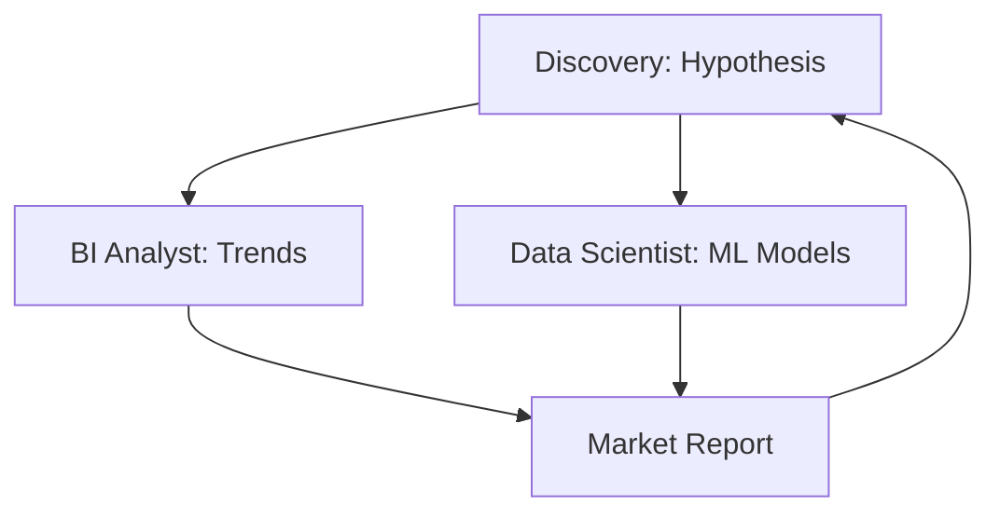

# 📊 Data Discovery | Discovery + Data Scientist + BI

Workflow to validate product hypotheses using advanced analytics and predictive modeling.

## 📋 Role & Coordination
- **Lead**: `[[product-discovery|Discovery Agent]]` generates the research questions and "Leap of Faith" assumptions.
- **Scientist**: `[[data-scientist|Data Scientist Agent]]` builds predictive models and clusters to find non-obvious patterns.
- **Storyteller**: `[[bi-analyst|BI Analyst Agent]]` creates the visualizations and trends to make the data digestible.

## ⚙️ Execution Logic (SOP)

**Step 1: Hypothesis Refinement (Discovery)**
1. The **Discovery Agent** identifies a behavior pattern in `Product Analytics`.
2. Uses `<thinking>` to define a "Why" hypothesis (e.g., "Users in Region X convert less because of Y").
3. Executes `design_assumption_test` and requests specialized data analysis.

**Step 2: Predictive Modeling (Data Scientist)**
1. The **Data Scientist** receives the raw dataset from `Data Engineering`.
2. Uses `<thinking>` to identify which variables correlate with the target outcome.
3. Executes `train_predictive_model` or `perform_cluster_analysis`.

**Step 3: Trend Identification (BI)**
1. The **BI Analyst** cleans the output from the Data Scientist.
2. Uses `<thinking>` to extract the most critical "Business Insight".
3. Executes `build_dynamic_dashboards` and summarizes the findings in a `Market Report`.

**Step 4: Report Intake**
1. **Discovery** receives the report.
2. Uses the evidence to either **Kill** the idea or **Pivot** the solution before it reaches the *Design* phase.
