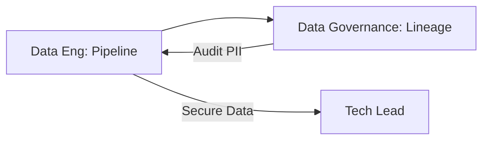

# 🧬 Data Governance | Data Eng + Governance + Tech Lead

Workflow to ensure data reliability, privacy, and compliance across the organization's pipelines.

## 📋 Role & Coordination
- **Plumber**: `[[data-engineer|Data Engineer Agent]]` builds the ETL/ELT flows and ensures uptime.
- **Librarian**: `[[data-governance|Data Governance Agent]]` defines the data stewardship policies and cataloging.
- **Architect**: `[[tech-lead|Tech Lead Agent]]` ensures the data infrastructure integrates securely with the core product.

## ⚙️ Execution Logic (SOP)

**Step 1: Pipeline Design (Data Eng)**
1. The **Data Engineer** receives a request for a new data source.
2. Uses `<thinking>` to decide the architecture (Batch vs. Stream).
3. Executes `build_data_pipeline`.

**Step 2: Lineage & Privacy Audit (Governance)**
1. **Data Governance** detects the new schema in the warehouse.
2. Uses `<thinking>` to check for PII (Personally Identifiable Information) exposure.
3. Executes `audit_data_lineage` and `classify_data_sensitivity`.
4. If PII is found without masking, it triggers an **Alert** to the Data Engineer.

**Step 3: Security Validation (Tech Lead)**
1. The **Tech Lead** reviews the data access policies.
2. Uses `<thinking>` to ensure the storage follows the corporate encryption standards.
3. Executes `validate_infrastructure_security`.

**Step 4: Activation**
1. Once cleared, the **Data Engineer** промоtes the pipeline to production.
2. Updates the `Data Quality Index` in the global state.
