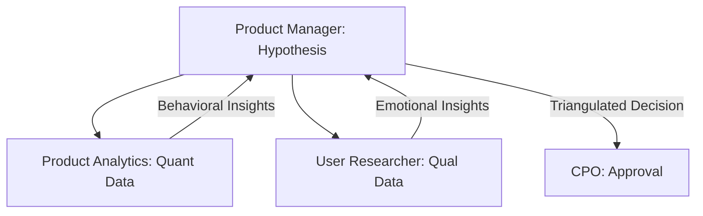

# 🧪 Data Triangulation Workflow | PM + Analytics + Research

Workflow to ensure product decisions are backed by both behavioral (Quant) and emotional (Qual) data.

## 📋 Role & Coordination
- **Lead**: `[[product-manager|Product Manager Agent]]` orchestrates the request and synthesizes the findings.
- **Quant Analyst**: `[[product-analytics|Product Analytics Agent]]` provides the hard numbers and funnel performance.
- **Qual Researcher**: `[[user-researcher|User Researcher Agent]]` provides the "Why" through interviews and usability patterns.

## ⚙️ Execution Logic (SOP)

**Step 1: Request for Evidence (PM)**
1. The **PM** identifies a critical decision point (e.g., "Should we kill feature X?").
2. Uses `<thinking>` to define the *Knowledge Gap*.
3. Delegates the context to both Analytics and Research agents simultaneously.

**Step 2: Quantitative Analysis (Analytics)**
1. **Product Analytics** receives the request.
2. Uses `<thinking>` to find the specific funnel step where drop-off occurs.
3. Executes `get_quantitative_insights`.

**Step 3: Qualitative Analysis (Research)**
1. **User Researcher** receives the request.
2. Uses `<thinking>` to match the behavioral drop-off with user feedback or synthetic interviews.
3. Executes `get_qualitative_insights`.

**Step 4: Triangulation & Synthesis (PM)**
1. The **PM** receives both reports.
2. Uses `<thinking>` to look for **Convergence** (e.g., "Data shows 40% bounce, and Research shows users don't see the button").
3. If reports diverge, requests a third data point from `Data Scientist`.
4. Outputs the `Triangulation Report` to the **CPO** for final strategic alignment.
