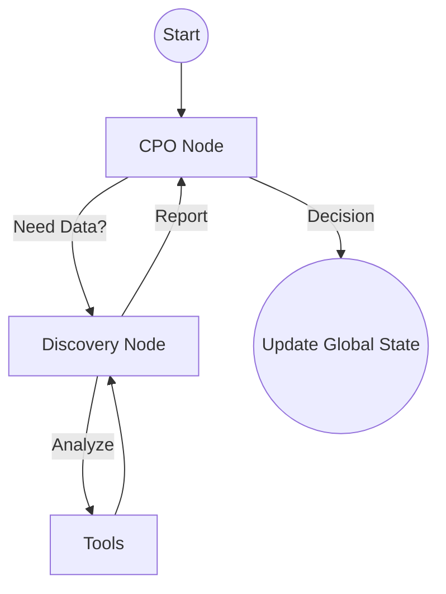

# 🔍 Discovery & Decision Loop

Workflow to move from strategic ambiguity to validated product initiatives.

## 📋 Role & Coordination
- **Strategist**: `[[cpo-agent|CPO Agent]]` provides the high-level roadmap and signs off on initiatives.
- **Lead**: `[[product-discovery|Discovery Agent]]` takes point on validating or invalidating the proposed initiatives.

## ⚙️ Execution Logic (SOP)

**Step 1: Triage (CPO)**
1. The **CPO** receives a strategic bet from the `Strategic Planning` workflow.
2. Uses `<thinking>` to decide if there's enough internal evidence to move to Design.
3. If not, creates a **Discovery Ticket** and delegates the context to the Discovery Agent.

**Step 2: Investigation (Discovery)**
1. The **Discovery Agent** receives the ticket.
2. Uses `<thinking>` to prioritize the research method (Qualitative vs. Quantitative).
3. Executes `build_opportunity_solution_tree`.

**Step 3: Tool Execution**
1. Invokes the `design_assumption_test` to run a small experiment.
2. Iterates internally until a clear `Insight` is generated.

**Step 4: Reporting & Closing**
1. **Discovery** sends the results back to the **CPO**.
2. **CPO** uses `<thinking>` to decide:
   - **GO**: The initiative moves to the `Design Cycle`.
   - **NO-GO**: The initiative is archived to the `Research Vault`.
   - **LOOPS**: Requests more data.
3. Updates the `Global Product State`.
