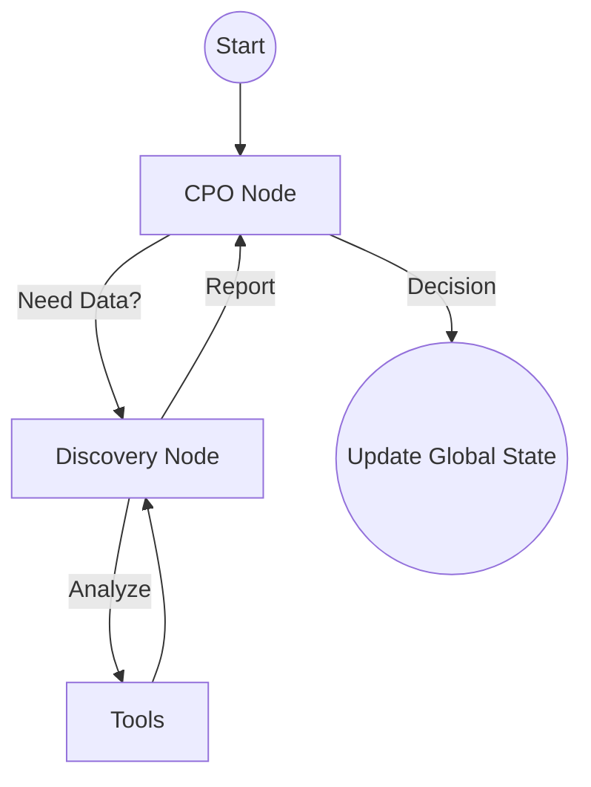

# 🔍 Discovery & Decision Loop
This workflow orchestrates the interaction between **CPO** and **Discovery**.

```mermaid
graph TD
    START((Start)) --> CPO[CPO Node]
    CPO -- "Need Data?" --> DISCO[Discovery Node]
    DISCO -- "Analyze" --> TOOLS[Tools]
    TOOLS --> DISCO
    DISCO -- "Report" --> CPO
    CPO -- "Decision" --> END((Update Global State))
```
