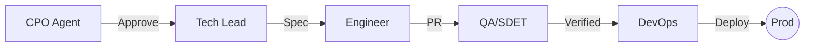

# 🛠️ Feature Delivery Loop

Mapping how Engineering verticals execute a feature from approval to production.

## 📋 Roles & Responsibilities
- **Strategist**: `[[cpo-agent|CPO Agent]]` authorizes the start of the delivery cycle based on ROI.
- **Architect**: `[[tech-lead|Tech Lead]]` ensures the technical feasibility and sets the stack.
- **Builder**: `[[software-engineer|Software Engineer Agent]]` writes the production-ready code.
- **Guardian**: `[[qa-sdet|QA/SDET Agent]]` verifies logic and handles regression testing.
- **Operator**: `[[devops-sre|DevOps & SRE Agent]]` manages the infrastructure and CI/CD pipelines.

## ⚙️ Execution Logic (SOP)

**Step 1: Technical Scoping (Tech Lead)**
1. The **Tech Lead** receives a `PRD` from the PM and approval from the **CPO**.
2. Uses `<thinking>` to assess technical risks (Latency/Debt/Security).
3. Executes `set_architecture_standards` and initializes the repository.

**Step 2: Coding & Documentation (Engineer)**
1. The **Engineer** picks the ticket.
2. Uses `<thinking>` to implement the feature with unit tests.
3. Executes `write_production_code` and opens a PR.

**Step 3: Verification (QA)**
1. The **QA Agent** detects the PR activity.
2. Uses `<thinking>` to identify potential regression areas.
3. Executes `run_load_test` and `verify_business_logic`.
4. If logic fails, it redirects back to Step 2 with the `report_defect` tool.

**Step 4: Deployment & Scaling (DevOps)**
1. Once QA approves, **DevOps** receives the deployment signal.
2. Uses `<thinking>` to evaluate cloud resource costs.
3. Executes `provision_environment` and `deploy_to_production`.

**Step 5: Monitoring**
1. **DevOps** monitors logs for anomalies (invoking `mitigate_incident` if necessary).
