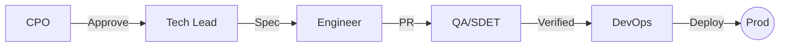

# 🛠️ Feature Delivery Loop
Mapping how Engineering verticals execute a feature.

```mermaid
graph LR
    CPO[CPO] -- "Approve" --> TL[Tech Lead]
    TL -- "Spec" --> DEV[Engineer]
    DEV -- "PR" --> QA[QA/SDET]
    QA -- "Verified" --> DEVOPS[DevOps]
    DEVOPS -- "Deploy" --> PROD((Prod))
```
