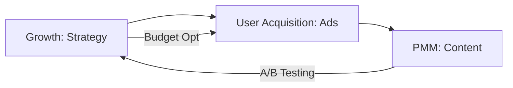

# 📈 Growth Funnel | Growth + UA + PMM

Workflow to accelerate customer acquisition and optimize marketing spend.

## 📋 Role & Coordination
- **Lead**: `[[product-growth|Product Growth Agent]]` identifies high-impact levers to reduce CAC and increase LTV.
- **Buyer**: `[[user-acquisition|User Acquisition Agent]]` manages paid media, bidding, and audience targeting.
- **Storyteller**: `[[product-marketing|Product Marketing Agent (PMM)]]` provides the creative assets and value props.

## ⚙️ Execution Logic (SOP)

**Step 1: Hypothesis Generation (Growth)**
1. The **Growth Agent** analyzes current CAC and LTV benchmarks.
2. Uses `<thinking>` to identify the "North Star" metric to move this week.
3. Executes `design_growth_experiment`.

**Step 2: Deployment (UA)**
1. The **UA Agent** receives the experimental target (e.g., "Lookalike audience in US").
2. Uses `<thinking>` to allocate the budget across channels (Google/Meta/Reddit).
3. Executes `launch_ad_campaign`.

**Step 3: Creative Alignment (PMM)**
1. The **PMM** provides the core message and visual concepts.
2. Uses `<thinking>` to ensure the message matches the landing page experience.
3. Executes `create_marketing_assets`.

**Step 4: Measurement & Optimization (Growth)**
1. After 7 days, the **Growth Agent** audits performance.
2. Uses `<thinking>` to decide if the experiment should be scaled, killed, or moved to A/B testing.
3. Executes `optimize_growth_funnel`.
