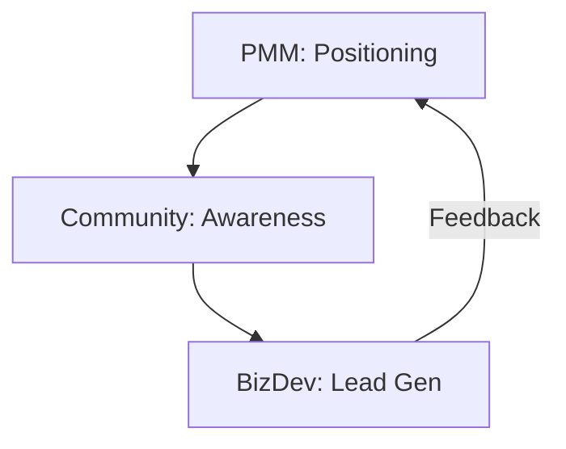

# 🚀 GTM Launch | PMM + Community + BizDev

Mapping how the "Go-To-Market Trio" orchestrates a product release.

## 📋 Role & Coordination
- **Lead**: `[[product-marketing|Product Marketing Agent (PMM)]]` defines the core message.
- **Amplifier**: `[[community-social|Community & Social Agent]]` translates the message for social platforms.
- **Closer**: `[[partnerships-bizdev|Partnerships & BizDev]]` identifies key accounts to target with the new feature.

## ⚙️ Execution Logic (SOP)

**Step 1: The Core Message (PMM)**
1. The **PMM** receives a `feature_id` from Product.
2. Uses `<thinking>` to define the *Unfair Advantage* of this feature.
3. Executes `create_go_to_market_strategy`.
4. Outputs the `core_messaging_pillars` to the global state.

**Step 2: Social Amplification (Community)**
1. The **Community Agent** reads the pillars.
2. Uses `<thinking>` to adapt the tone for Twitter/LinkedIn/Discord.
3. Executes `coordinate_social_campaign`.

**Step 3: Direct Outreach (BizDev)**
1. The **BizDev Agent** identifies which existing partners or new leads benefit most from this specific feature.
2. Uses `<thinking>` to draft a personalized value proposition.
3. Executes `identify_strategic_alliances`.

**Step 4: Feedback Loop**
1. BizDev reports the "Willingness to Pay" or "Friction" encountered in the field back to the **PMM**.
2. **PMM** updates the strategy if necessary.
