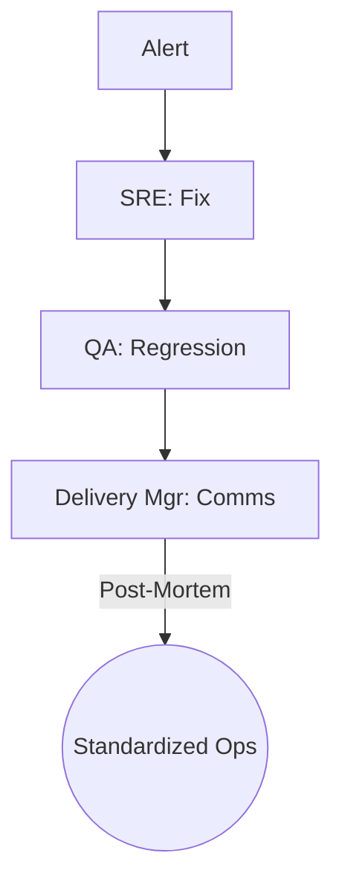

# 🚨 Incident Response | SRE + QA + Delivery Manager

```mermaid
graph TD
    ALRT[Alert] --> SRE[SRE: Fix]
    SRE --> QA[QA: Regression]
    QA --> DM[Delivery Mgr: Comms]
    DM -- "Post-Mortem" --> END((Standardized Ops))
```
