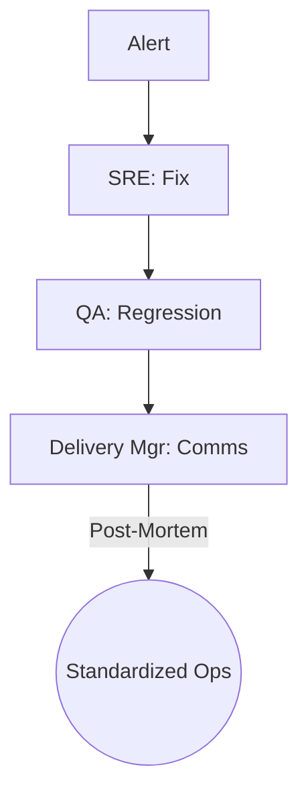

# 🚨 Incident Response | SRE + QA + Delivery Manager

Workflow to mitigate downtime and ensure platform reliability under critical failures.

## 📋 Role & Coordination
- **Operator**: `[[devops-sre|DevOps & SRE Agent]]` takes point on fixing the root cause and mitigating the impact.
- **Guardian**: `[[qa-sdet|QA/SDET Agent]]` ensures the fix doesn't introduce regressions or break dependencies.
- **Liaison**: `[[delivery-manager|Delivery Manager Agent]]` handles stakeholder communications and manages the incident timeline.

## ⚙️ Execution Logic (SOP)

**Step 1: Triage & Mitigation (SRE)**
1. The **SRE** receives an alert from external monitoring tools.
2. Uses `<thinking>` to assess the blast radius (Users affected/API downtime).
3. Executes `mitigate_incident` (e.g., Rollback, Circuit Braking).
4. Updates the global state with the `incident_status`.

**Step 2: Regression Check (QA)**
1. Once mitigated, **QA** receives a "Stable" signal.
2. Uses `<thinking>` to identify which core services might be unstable due to the rollback.
3. Executes `run_regression_tests`.
4. If failure persists, it re-delegates to **SRE** with detailed logs.

**Step 3: Communication (Delivery Manager)**
1. The **Delivery Manager** monitors the mitigation progress.
2. Uses `<thinking>` to draft an internal update for the CEO/CPO.
3. Executes `report_incident_impact`.

**Step 4: Post-Mortem**
1. After resolution, **SRE** leads a `post_mortem` analysis.
2. Identifying the `Core Root Cause` and proposing a permanent structural fix to the **CTO**.
3. Updating the `Reliability Score` of the affected service.
