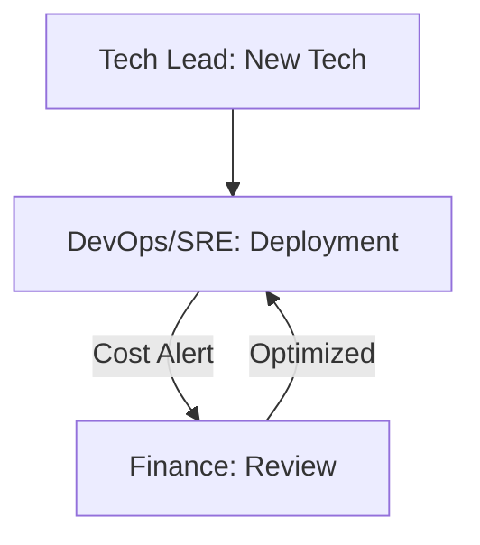

# ⚙️ Cloud Ops | DevOps + Tech Lead + Finance

Workflow to manage infrastructure expansion while maintaining financial and technical efficiency.

## 📋 Role & Coordination
- **Architect**: `[[tech-lead|Tech Lead Agent]]` defines the needed technical requirements (e.g., GPU clusters, DB replicas).
- **Operator**: `[[devops-sre|DevOps & SRE Agent]]` executes the provisioning and monitors the consumption.
- **Auditor**: `[[finance-agent|Finance Agent]]` ensures the scaling doesn't exceed the burn rate limits.

## ⚙️ Execution Logic (SOP)

**Step 1: Requirement Specification (Tech Lead)**
1. The **Tech Lead** identifies a bottleneck or a new AI model requirement.
2. Uses `<thinking>` to forecast the needed throughput and scalability metrics.
3. Executes `define_architecture_requirements`.

**Step 2: Provisioning (DevOps)**
1. **DevOps** receives the spec and checks the current cloud usage.
2. Uses `<thinking>` to compare "On-demand" vs "Reserved" instances to maximize efficiency.
3. If the cost is > 10% of monthly cloud budget, triggers an **Alert** to Finance.
4. Executes `allocate_cloud_resources`.

**Step 3: Cost Audit (Finance)**
1. **Finance** receives the Cost Alert.
2. Uses `<thinking>` to analyze the `infrastructure_ROI`.
3. Suggests optimizations (e.g., "Use Spot Instances", "Delay non-critical scaling").
4. Executes `validate_budget_availability`.

**Step 4: Implementation**
1. **DevOps** applies the optimization directives and finalizes the deployment.
2. Updates the `infrastructure_cost_index` in the global state.
