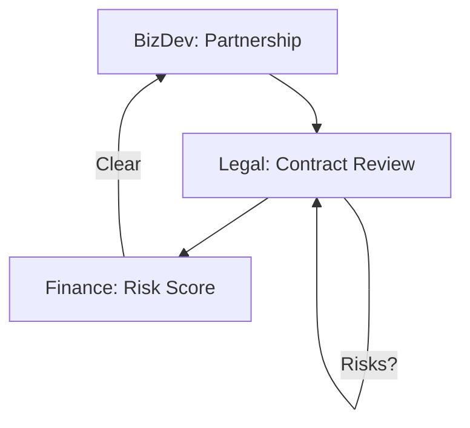

# ⚖️ Risk & Governance | BizDev + Legal + Finance

Workflow to vet new business partnerships, contracts, and regulatory exposure.

## 📋 Role & Coordination
- **Lead**: `[[partnerships-bizdev|Partnerships Agent]]` initiates the conversation and identifies the business opportunity.
- **Guard**: `[[legal-compliance|Legal & Compliance Agent]]` scrutinizes the contractual clauses and GDPR/SOC2 alignment.
- **Auditor**: `[[finance-agent|Finance Agent]]` calculates the liability risk and the financial impact on the company's valuation.

## ⚙️ Execution Logic (SOP)

**Step 1: Opportunity Triage (BizDev)**
1. **BizDev** identifies a new partnership or strategic deal.
2. Uses `<thinking>` to define the *Expected Upside* (Revenue/Reach).
3. Executes `identify_strategic_alliances`.

**Step 2: Legal Audit (Legal)**
1. **Legal** receives the draft contract or MoU.
2. Uses `<thinking>` to find potential "Red Flags" (e.g., Exclusivity, Data Purity, Intellectual Property).
3. Executes `review_data_privacy` or `audit_contract_risk`.
4. If risk is high, it iterates with **BizDev** for clause renegotiation.

**Step 3: Risk Scoring (Finance)**
1. **Finance** receives the legal verdict.
2. Uses `<thinking>` to calculate a **Strategic Risk Score (SRS)** based on the contract's potential liabilities.
3. Decides if the profit margin covers the legal risk.

**Step 4: Decision Finalization**
1. If the score is within limits, **Legal** authorizes the digital signature.
2. Updates the `Compliance Status` of the specific partnership in the global state.
