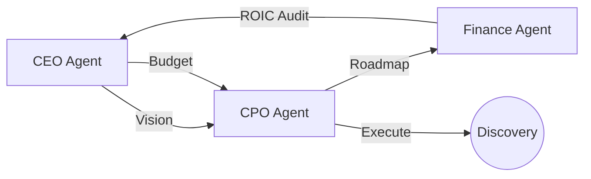

# 👑 Strategic Planning | CEO + CPO + Finance

How the executive team aligns vision with budget and operational limits.

## 📋 Role & Coordination
- **Visionary**: `[[ceo-agent|CEO Agent]]` sets the high-level mission and market objective.
- **Strategist**: `[[cpo-agent|CPO Agent]]` translates vision into a prioritized roadmap of "Strategic Bets".
- **Comptroller**: `[[finance-agent|Finance Agent]]` provides the capital constraints and expected ROIC.

## ⚙️ Execution Logic (SOP)

**Step 1: Mission Alignment (CEO)**
1. The **CEO** receives market signals (competitor moves or board directives).
2. Uses `<thinking>` to decide if a pivot or new cycle is needed.
3. Executes `set_company_okrs` to notify the CPO.

**Step 2: Roadmap Definition (CPO)**
1. The **CPO** reads the company OKRs.
2. Uses `<thinking>` to identify which product pillars support the mission.
3. Executes `define_strategic_priorities` and requests a budget forecast.

**Step 3: Financial Validation (Finance)**
1. **Finance** reviews the requested amount compared to the current runway.
2. Uses `<thinking>` to calculate the ROIC of the proposed roadmap.
3. If valid, executes `validate_budget_availability`.

**Step 4: Decision & Allocation**
1. **CEO** reviews the combined "Roadmap + ROI" report.
2. Uses `<thinking>` tag to finalize the resource distribution.
3. Executes `allocate_budget`.
4. **Approval**: If allocated, CPO triggers the `Discovery Loop`.
5. **Halt**: If funds are lacking, CEO executes `pivot_company_strategy`.
