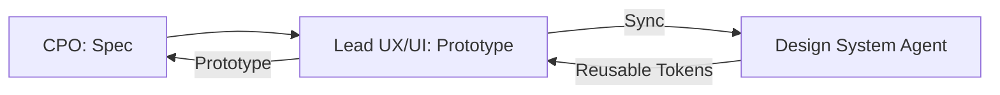

# 🎨 Design Cycle | CPO + UI/UX + Design System

Workflow to transform product requirements into standardized, high-fidelity user experiences.

## 📋 Role & Coordination
- **Lead**: `[[lead-designer|Lead Designer Agent]]` creates the interaction models and validates the user flow.
- **Strategist**: `[[cpo-agent|CPO Agent]]` provides the high-level PRD and success metrics.
- **Librarian**: `[[design-system|Design System Agent]]` provides the reusable tokens (colors, spacings, components) to ensure consistency.

## ⚙️ Execution Logic (SOP)

**Step 1: Conceptualization (CPO)**
1. The **CPO** sends a PRD and a list of `Outcome` targets to the design team.
2. Uses `<thinking>` to define the core problem and user archetype.

**Step 2: Prototyping (Designer)**
1. The **Lead Designer** receives the spec and identifies the primary user journey.
2. Uses `<thinking>` to decide between "Low-fidelity" wireframes or "High-fidelity" interactions.
3. Executes `create_interactive_prototypes`.

**Step 3: Standardization (Design System)**
1. The **Design System Agent** audits the prototype created by the Lead Designer.
2. Uses `<thinking>` to see if new tokens or patterns are being introduced unnecessarily.
3. Executes `validate_design_consistency`.
4. If non-standard elements are found, it proposes an alternative using existing Figma/CSS tokens.

**Step 4: Validation Loop**
1. Once standardized, the final `interactive_prototype` is sent back to the **CPO**.
2. **CPO** uses it to pitch to the CEO or authorize the move to the `Feature Delivery Loop`.
